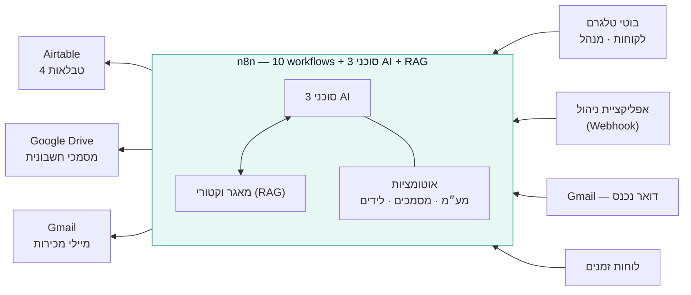

# AI Electronics ERP

**מערכת ניהול עסק חכמה — פרויקט גמר**

מערכת ERP קטנה לעסק אלקטרוניקה ישראלי (AI Electronics), שבה סוכני בינה מלאכותית
ותהליכי אוטומציה מבצעים את רוב העבודה התפעולית.

 

 

 

---

## מה המערכת עושה

| שכבה | במה מומש | תפקיד |
|---|---|---|
| **נתונים** | Airtable | 4 טבלאות — Invoices, Leads, Products, Tasks — מקור האמת |
| **לוגיקה ואוטומציה** | n8n Cloud | 10 workflows + 3 סוכני AI + מאגר וקטורי (RAG) |
| **ממשק** | אפליקציית ווב (Lovable / Base44) | דשבורד, טבלאות, טפסים וצ'אט — הכל מול webhook יחיד |

<table>
<tr>
<td width="50%" valign="top">

### לידים
קליטה מ-webhook, סינון כפילויות לפי אימייל, מייל מכירה קר אוטומטי כל 3 שעות, וזיהוי תשובה מ-Gmail כל 30 דקות.

</td>
<td width="50%" valign="top">

### שירות לקוחות
בוט טלגרם שעונה **רק** מתוך מסמכי המדיניות והקטלוג (RAG). לא יודע? מפנה לנציג אנושי.

</td>
</tr>
<tr>
<td valign="top">

### חשבוניות ומע"מ
כל חשבונית חדשה מאומתת, מקבלת מספר סידורי (INV-0001...) ומע"מ מחושב לפי תאריך (17% עד סוף 2024, 18% אחריו).

</td>
<td valign="top">

### הנהלה
בוט טלגרם לבעלים עם כלי חיפוש דינמי בחשבוניות (Airtable Tool), מוגן בשער זהות לפי `chat.id`.

</td>
</tr>
<tr>
<td valign="top">

### הפקת מסמכים
חשבונית מאושרת הופכת אוטומטית ל-HTML מעוצב ועולה ל-Google Drive, עם קישור חוזר ל-Airtable.

</td>
<td valign="top">

### ממשק אחיד
כל כתיבה/קריאה של האפליקציה — Dashboard, Leads, Invoices, Products, Tasks, Chat — עוברת דרך webhook יחיד.

</td>
</tr>
</table>

> **אפס שורות קוד.** כל הלוגיקה מיושמת בצמתים מוכנים של n8n.

---

## ארכיטקטורה

---

## מבנה הבסיס (Airtable)

| טבלה | שדות |
|---|---|
| Invoices | InvoiceNumber, CustomerId, Amount, VatAmount, Total, Status, PdfUrl, Created |
| Leads | Name, Email, Company, Status, Created |
| Products | Name, Category, Price, Description, InStock |
| Tasks | Title, Status |

פרטים מלאים ב-[`schema.json`](schema.json).

---

## ה-10 workflows (תיקיית [`workflows/`](workflows))

| # | Workflow | טריגר | מה עושה |
|---|---|---|---|
| 1 | Tax Validation | חשבונית חדשה ב-Airtable | מוודא תקינות, מחשב מע״מ לפי תאריך, נותן מספר סידורי, מעביר לתור הפקה |
| 2 | Leads Intake | Webhook (ליד חדש) | בודק כפילויות לפי אימייל, כותב רשומה נקייה ל-Leads |
| 3 | Sales — Cold Emails | כל 3 שעות | מנסח מייל מכירה קר עם LLM ושולח ב-Gmail ללידים חדשים |
| 4 | Sales — Reply Check | כל 30 דקות | סורק תשובות ב-Gmail ומעדכן סטטוס ליד תואם |
| 5 | Customer Service Agent | בוט טלגרם #2 (לקוחות) | סוכן AI מבוסס RAG — עונה רק ממסמכים מאונדקסים |
| 6 | Policies → Vector Store | ידני (טופס) | מטמיע את מסמכי המדיניות למאגר הווקטורי |
| 7 | Products → Vector Store | ידני (טופס) | מטמיע את קטלוג המוצרים למאגר הווקטורי |
| 8 | InvoiceMaker | כל דקה | בונה חשבונית HTML, מעלה ל-Google Drive, שומר קישור |
| 9 | Manager Agent | בוט טלגרם #1 (בעלים בלבד) | סוכן AI עם כלי חיפוש דינמי בחשבוניות (Airtable Tool) |
| 13 | App API | Webhook (מהאפליקציה) | נקודת כניסה יחידה: read / create / update / chat |

---

## הפעלה

1. ייבאו כל קובץ מ-`workflows/` ל-n8n (Import from File).
2. בכל צומת Airtable בחרו מחדש Base + Table מהבסיס שלכם.
3. חברו credentials (Airtable, OpenAI, Gmail, Telegram ×2, Google Drive).
4. הריצו ידנית פעם אחת את #6 ו-#7 (RAG).
5. הפעילו (Activate) את שאר 8 ה-workflows.
6. חברו את האפליקציה ל-webhook production URL של #13.

---

## צילומי מסך

### האפליקציה

| | |
|---|---|
|  |  |
| לוח בקרה — סיכום לידים, חשבוניות ממתינות, הכנסות ומשימות | מסך לידים — טאבים לפי סטטוס, טופס הוספה |
|  | |
| מסך חשבוניות — תג סטטוס צבעוני וקישור למסמך | |

### הקנבסים ב-n8n

| קובץ | תוכן |
|---|---|
| `screenshots/wf1-tax-validation-canvas.png` | WF1 — אימות מסמכי מס, חישוב מע"מ ומספור סידורי |
| `screenshots/wf3-sales-cold-emails-canvas.png` | WF3 — סוכן מכירות: ניסוח ושליחת מייל קר |
| `screenshots/wf5-customer-service-canvas.png` | WF5 — סוכן שירות לקוחות עם שני כלי RAG |
| `screenshots/wf6-vector-store-canvas.png` | WF6/7 — הטמעת מדיניות/מוצרים למאגר הווקטורי |
| `screenshots/wf8-invoicemaker-canvas.png` | WF8 — בניית HTML והעלאה ל-Drive |
| `screenshots/wf9-manager-agent-canvas.png` | WF9 — סוכן המנהל עם בקרת הרשאות לפי Chat ID |
| `screenshots/wf13-app-api-canvas.png` | WF13 — נקודת הכניסה של האפליקציה, ניתוב לפי action |

---

## מגבלות ידועות

- המאגר הווקטורי (RAG) בזיכרון — נמחק בכל restart של n8n, צריך להריץ מחדש #6/#7.
- מספור החשבוניות עלול להתנגש בריצה מקבילית (אתגר פתוח).
- אין המרת PDF אמיתית — המסמך נשמר כ-HTML.
